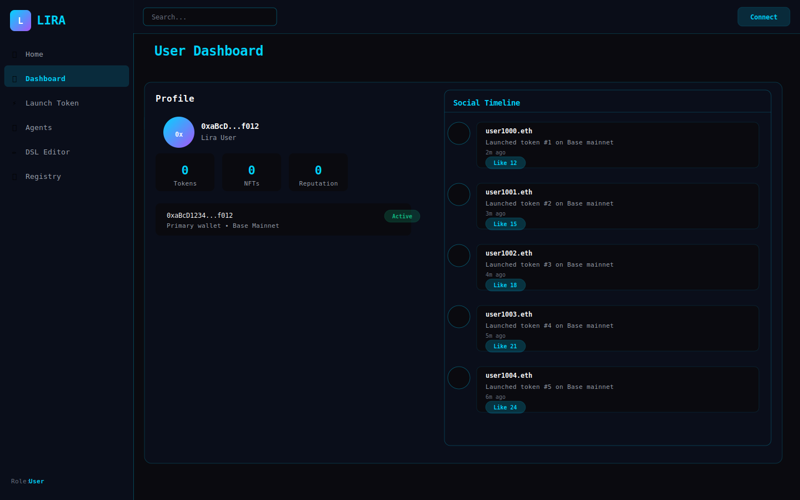
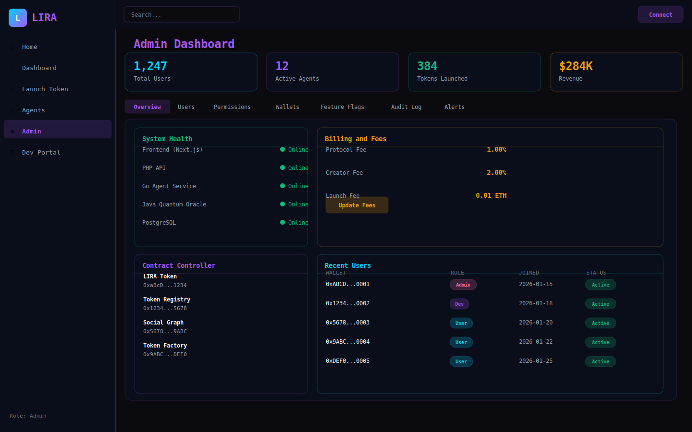
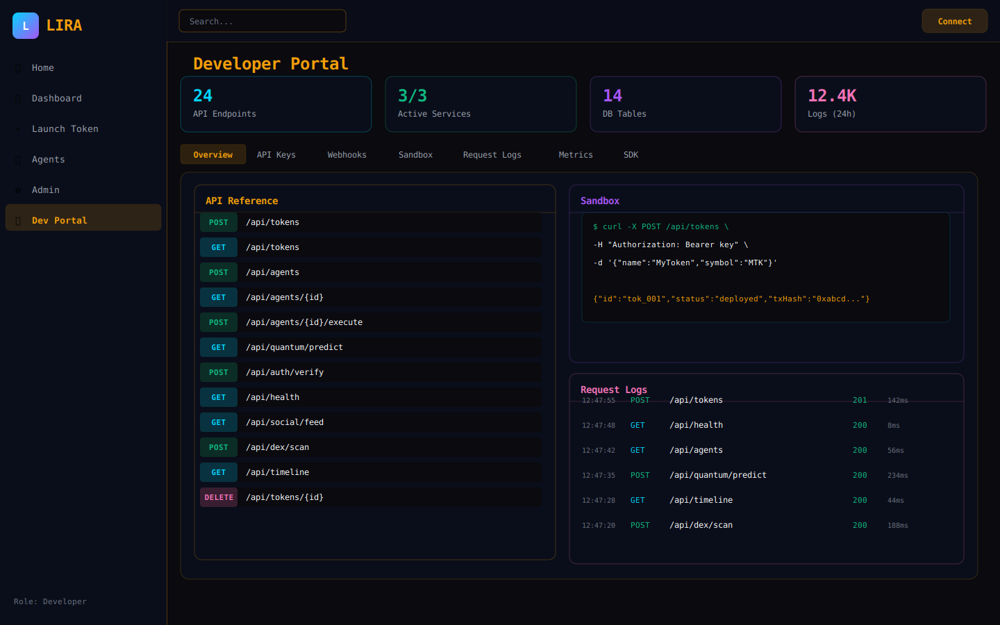
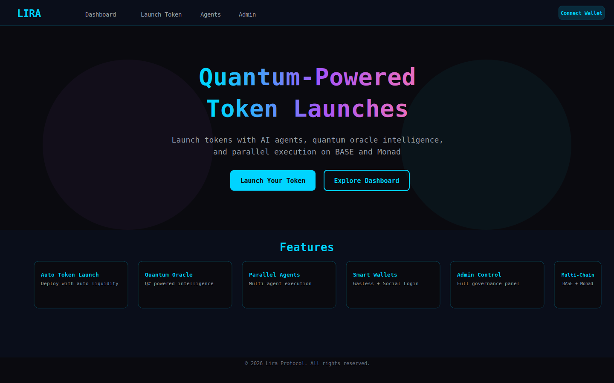
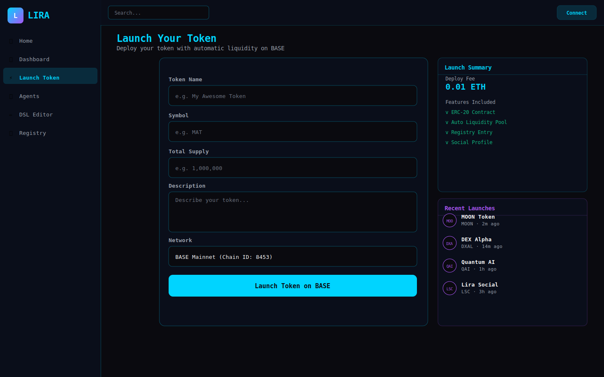
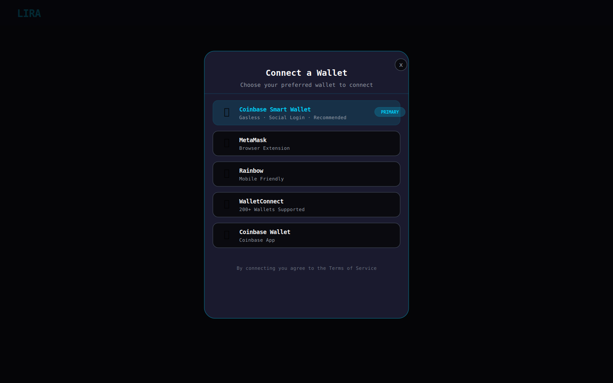
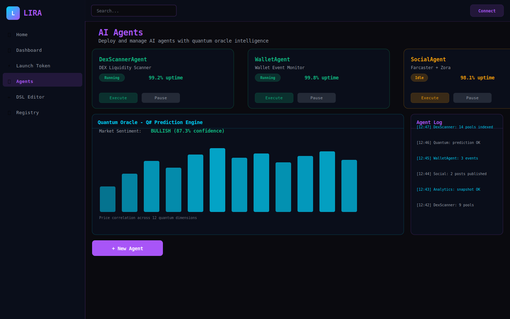
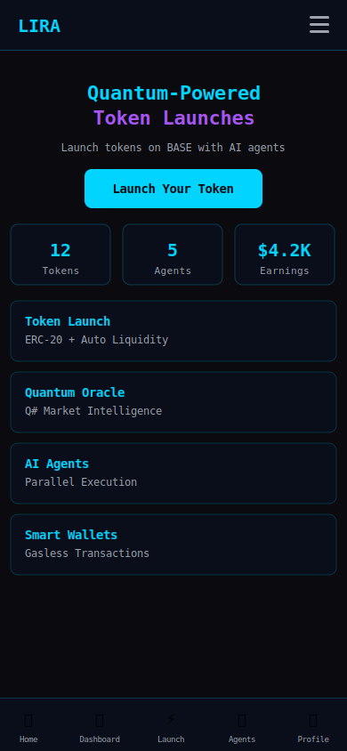

LIRA Protocol — Production-Ready Token Launch Platform

Lightweight • Immutable • Resilient • Autonomous

🚀 **Status**: Production Ready | **Build**: Passing ✓ | **Deployment**: Vercel Ready

---

## Overview

LIRA is a comprehensive Web3 platform for token launches, AI agents, and DAO management. Built on BASE (Coinbase L2), it combines quantum oracle intelligence with modern wallet connectivity and role-based access control.

### Key Capabilities

- **🪙 Token Launcher** - One-click token deployment with automatic liquidity
- **🤖 AI Agents** - Quantum-powered intelligent agents with parallel execution
- **💼 Multi-Dashboard** - Role-based access (User, Admin, Developer)
- **🔐 SmartWallet Auth** - Coinbase Smart Wallet + Traditional wallets
- **👤 DAO Username** - Username-based identity with DAO token resolution
- **⚡ Multi-Chain** - BASE mainnet/testnet with EVM compatibility

---

## Quick Start

```bash
# Clone and install
git clone https://github.com/SMSDAO/lira.git
cd lira
npm install

# Configure (add your WalletConnect ID)
cp .env.example .env.local

# Start development
npm run dev
```

Open [http://localhost:3000](http://localhost:3000) and connect your wallet!

📖 **Full Guide**: [docs/QUICKSTART.md](./docs/QUICKSTART.md)

---

## ✨ Features

### 🎯 Core Platform
- **Token Launch Factory** - Deploy ERC20 tokens with built-in liquidity
- **AI Agent Execution** - Create and run intelligent agents
- **Quantum Oracle** - Q# powered market predictions
- **Social Features** - Timeline, posts, and interactions

### 🔐 Authentication & Access
- **SmartWallet Primary** - Coinbase Smart Wallet (gasless, social login)
- **Multi-Wallet Support** - MetaMask, WalletConnect, Rainbow, and more
- **DAO Token Resolution** - Username-based authentication
- **Role-Based Access** - User, Admin, and Developer dashboards

### 📊 Dashboards

#### User Dashboard (`/dashboard`)
- Portfolio overview
- Token holdings
- Agent management
- Earnings tracking

#### Admin Dashboard (`/admin`)  
*Requires admin wallet address*
- User management
- Fee configuration
- System health
- Billing control

#### Developer Portal (`/dev`)  
*Requires dev wallet address*
- API documentation
- System logs
- Health monitoring
- Testing tools

---

## UI Preview

The Lira Protocol features a **Pixels-style modern app UI** — dark base (#0B0F1A), purple→blue gradient accents, glassmorphism panels, and neon glow effects.


> Screenshots are auto-generated after each build via `scripts/screenshot.ts` (requires `npx playwright install chromium`).

---

## 🖥️ User Interface

The Lira Protocol features a cutting-edge **Aura FX Neo Digital UI** — a high-contrast dark theme with neon glow effects, fluid animations powered by Framer Motion, and a modern neo-digital aesthetic inspired by Zora. Each role-based dashboard provides a purpose-built workspace for its audience.

---

## 📸 Screenshots

### Role-Based Dashboards

<div align="center">

| User Dashboard | Admin Dashboard | Developer Portal |
| :---: | :---: | :---: |
| <a href="docs/screenshots/user-dashboard.svg"></a> | <a href="docs/screenshots/admin-dashboard.svg"></a> | <a href="docs/screenshots/developer-portal.svg"></a> |
| *Social Timeline & Smart Wallet* | *Billing, Fees & Contract Control* | *API Docs, Sandbox & Request Logs* |

</div>

### Core Flows

<div align="center">

| Landing Page | Token Launch Flow | Wallet Connect Modal |
| :---: | :---: | :---: |
| <a href="docs/screenshots/landing-page.svg"></a> | <a href="docs/screenshots/token-launch-flow.svg"></a> | <a href="docs/screenshots/wallet-connect-modal.svg"></a> |
| *Hero & Feature Highlights* | *One-Click ERC20 Deployment* | *RainbowKit Multi-Wallet Picker* |

</div>

### AI Agents & Mobile

<div align="center">

| AI Agent Executor | Mobile Responsive View |
| :---: | :---: |
| <a href="docs/screenshots/agent-executor.svg"></a> | <a href="docs/screenshots/mobile-responsive.svg"></a> |
| *Parallel Agents & Quantum Oracle Chart* | *390 px — Full Mobile Parity* |

</div>

> All screenshots showcase the **Aura FX Neo Digital** theme: `#00d4ff` neo-blue (User), `#a855f7` neo-purple (Admin), `#f59e0b` neo-amber (Developer).

---

### Dashboard Highlights

**User Dashboard** — `/dashboard`  
Neo-digital social timeline with Aura FX glow effects. Displays token portfolio, smart wallet balances, agent earnings, and a Zora-inspired activity feed.

**Admin Dashboard** — `/admin`  
Full protocol governance panel: manage billing, configure protocol fees, control smart contracts on BASE/Monad, and monitor system health in real time via `BillingSection`, `ContractController`, and `SecuritySection` components.

**Developer Dashboard** — `/dev`  
Token Launcher with one-click ERC20 deployment, Parallel Agent Executor with Quantum Oracle (`Q#`) visualization, live API logs, and testing tools.

### 🛠️ Tech Stack
- **Frontend**: Next.js 16, React 18, TypeScript
- **Styling**: Tailwind CSS, Framer Motion
- **Web3**: Wagmi v2, Viem, RainbowKit v2
- **Backend**: PHP, Go, Java (multi-service)
- **Database**: PostgreSQL + Prisma ORM
- **Blockchain**: BASE (Coinbase L2), Solidity, OpenZeppelin
- **Quantum**: Q# (Microsoft Quantum)

---

## 📁 Repository Structure

```
lira/
├── src/
│   ├── pages/          # Next.js pages
│   │   ├── dashboard/  # User dashboard
│   │   ├── admin/      # Admin dashboard
│   │   ├── dev/        # Developer portal
│   │   ├── launch/     # Token launcher
│   │   └── agents/     # AI agents
│   ├── components/     # React components
│   ├── lib/           # Core libraries (RBAC, etc.)
│   ├── hooks/         # Custom React hooks
│   └── styles/        # Global styles
├── backend/
│   ├── php/           # PHP REST API
│   ├── go/            # Go agent service
│   └── java/          # Java quantum oracle
├── contracts/         # Solidity smart contracts
├── docs/              # Comprehensive documentation
├── scripts/           # Deployment scripts
└── test/             # Test suites
```

---

## 🚀 Deployment

### Vercel (Recommended)

1. Push to GitHub
2. Import project in Vercel
3. Set environment variables
4. Deploy!

See [docs/VERCEL_DEPLOYMENT.md](./docs/VERCEL_DEPLOYMENT.md) for complete guide.

### Docker

```bash
docker-compose up -d
```

---

## 📚 Documentation

| Document | Description |
|----------|-------------|
| [Quick Start](./docs/QUICKSTART.md) | Get started in 10 minutes |
| [SmartWallet Auth](./docs/SMARTWALLET_AUTH.md) | Authentication & DAO token resolution |
| [RBAC Dashboards](./docs/RBAC_DASHBOARDS.md) | Role-based access control |
| [Vercel Deployment](./docs/VERCEL_DEPLOYMENT.md) | Deploy to Vercel |
| [API Reference](./docs/API.md) | Complete API documentation |
| [Testing Guide](./docs/TESTING.md) | Testing procedures |
| [Security Audit](./docs/SECURITY_AUDIT.md) | Security considerations |
| [Full Docs](./docs/README.md) | Comprehensive documentation |

---

## 🛠️ Development

### Install Dependencies
```bash
npm install
```

### Run Development Server
```bash
npm run dev
```

### Build for Production
```bash
npm run build
npm start
```

### Run Tests
```bash
npm test
npm run test:watch
```

### Lint Code
```bash
npm run lint
```

---

## 🔐 Environment Configuration

### Required Variables

```env
# Wallet Connect (get from https://cloud.walletconnect.com/)
NEXT_PUBLIC_WALLET_CONNECT_ID=your_project_id

# Chain Configuration
NEXT_PUBLIC_CHAIN_ID=8453
NEXT_PUBLIC_CHAIN_NAME=base

# Role-Based Access
ADMIN_ADDRESSES=0xYourAdminWallet
DEV_ADDRESSES=0xYourDevWallet
```

See [.env.example](./.env.example) for complete configuration.

---

## 🧪 Testing

The project includes comprehensive test suites:

- **Unit Tests**: Jest + React Testing Library
- **Contract Tests**: Hardhat + Chai
- **Integration Tests**: End-to-end workflows

```bash
# Run all tests
npm test

# Run with coverage
npm test -- --coverage

# Run contract tests
npm run contracts:test
```

---

## 🤝 Contributing

We welcome contributions! Please see [CONTRIBUTING.md](./CONTRIBUTING.md) for guidelines.

### Development Workflow
1. Fork the repository
2. Create a feature branch (`git checkout -b feature/amazing-feature`)
3. Make your changes
4. Run tests (`npm test`)
5. Commit your changes (`git commit -m 'Add amazing feature'`)
6. Push to the branch (`git push origin feature/amazing-feature`)
7. Open a Pull Request

---

## 🔒 Security

Security is our top priority. See [docs/SECURITY_AUDIT.md](./docs/SECURITY_AUDIT.md) for:
- Security best practices
- Audit procedures
- Vulnerability reporting

**Found a security issue?** Please email security@lira.ai instead of opening a public issue.

---

## 📊 Project Status

✅ **Build**: Passing  
✅ **Tests**: Unit + contract tests included  
✅ **Deployment**: Vercel ready  
✅ **Documentation**: Complete  
✅ **Screenshots**: Full gallery in `docs/screenshots/` (8 SVGs)  
✅ **Rust Core**: Production Beta — `core-engine/` crate with ≥ 80% test coverage  
🔄 **Production Beta**: Stabilized for audit — mainnet deployment pending final review  

### Recent Updates
- 🦀 Rust core engine (`core-engine/`) — parser, lexer, WASM bindings, 80% coverage gate
- ✨ Production Beta milestone — role-based dashboard system fully operational
- ✨ Complete UI gallery — 8 Aura FX Neo Digital screenshots added to `docs/screenshots/`
- ✨ Developer portal with API docs, sandbox, and request logs
- ✨ Vercel deployment configuration
- ✨ SmartWallet (Coinbase) as primary authentication method
- ✨ Comprehensive documentation rewrite across `docs/sections/`

---


## 📜 License

MIT License - see [LICENSE.md](./LICENSE.md) for details.

Open source and available for builders, creators, and ecosystem partners.

---

## 🌟 Acknowledgments

Built with ❤️ by SMSDAO

Special thanks to:
- **BASE** (Coinbase L2) - Infrastructure
- **RainbowKit** - Wallet connectivity
- **Wagmi** - React hooks for Ethereum
- **OpenZeppelin** - Secure smart contracts
- **Next.js** - React framework
- **Tailwind CSS** - Utility-first CSS

---

## 🏗️ Enterprise Platform Architecture

Lira Protocol has been expanded into a fully autonomous enterprise Web3 AI platform. The new platform layers are:

```
lira/
├── src/
│   ├── agents/          # Agent swarm (9 specialised agents)
│   ├── auth/            # Enterprise auth: email, OAuth, wallet (RainbowKit), Farcaster
│   ├── config/          # Centralised environment configuration
│   ├── core/rbac/       # Extended RBAC – 7-tier role hierarchy
│   ├── dex/             # DEX scanner (Uniswap, Sushi, Pancake, Curve, Balancer, GMX)
│   ├── jobs/            # Background jobs (BullMQ-compatible)
│   ├── models/          # Typed data models (Permission, DexToken, TimelineEvent)
│   ├── observability/   # Logging, Prometheus metrics, OpenTelemetry tracing
│   ├── security/        # Rate limiting, CSRF, CSP, request validation, audit log
│   ├── services/        # Contract wrappers, AI image generation
│   ├── timeline/        # Platform-wide event timeline
│   ├── wasm/            # WASM bindings (crypto verify, DEX math)
│   └── web3/
│       ├── contracts/   # Auto-generated contract interfaces
│       └── social/      # Farcaster + Zora integration
├── wasm/                # WASM build instructions
└── docs/sections/       # Architecture, API, agents, security, dex, web3, deployment
```

### Dashboards

| Dashboard | Path | Access |
|-----------|------|--------|
| User Dashboard | `/dashboard/user` | All authenticated users |
| Admin Dashboard | `/dashboard/admin` | Admin role |
| Developer Portal | `/dashboard/dev` | Developer + Admin |
| System Control | `/dashboard/system` | Admin role |

### RBAC Roles

`guest` → `user` → `creator` → `developer` → `moderator` → `admin` → `super-admin`

All permissions are defined in [`src/models/Permission.ts`](./src/models/Permission.ts).

### Agent Swarm

| Agent | Purpose |
|-------|---------|
| `AgentCoordinator` | Task dispatching and health monitoring |
| `DexScannerAgent` | Indexes DEX liquidity pools |
| `WalletAgent` | Monitors wallet RPC events |
| `ImageGenerationAgent` | AI image generation (OpenAI / Stable Diffusion / Replicate) |
| `SocialAgent` | Farcaster + Zora publishing |
| `AnalyticsAgent` | Protocol analytics aggregation |
| `MonitoringAgent` | Service health monitoring |
| `NotificationAgent` | User notification delivery |
| `GovernanceAgent` | On-chain governance processing |

### Documentation

Full platform documentation is in [`docs/sections/`](./docs/sections/):
- [Architecture](./docs/sections/architecture.md)
- [Agents](./docs/sections/agents.md)
- [API Reference](./docs/sections/api.md)
- [DEX Integration](./docs/sections/dex.md)
- [Web3 Integration](./docs/sections/web3.md)
- [Security](./docs/sections/security.md)
- [Deployment](./docs/sections/deployment.md)

---

## 📞 Support & Resources

- **Documentation**: [docs/README.md](./docs/README.md)
- **Quick Start**: [docs/QUICKSTART.md](./docs/QUICKSTART.md)
- **GitHub Issues**: [Report a bug](https://github.com/SMSDAO/lira/issues)
- **Email**: support@lira.ai

---

## 🎯 Roadmap

### ✅ Phase 1: Core Platform (Complete)
- Multi-wallet authentication
- Token launch factory
- AI agent execution
- Role-based dashboards

### 🔄 Phase 2: Enhancement (In Progress)
- SmartWallet as primary auth
- DAO username resolution
- Enhanced developer tools
- Comprehensive documentation

### 🚀 Phase 3: Production (Next)
- Professional security audit
- Mainnet deployment
- Performance optimization
- Community onboarding

### 📱 Phase 4: Expansion (Future)
- Mobile application
- Additional chain support
- Advanced analytics
- Governance features

---

**Ready to launch?** 🚀

Start with `npm run dev` and explore the platform!

---

*Last Updated: 2026-05-02*  
*Version: 1.0.0*  
*Status: Production Beta*
